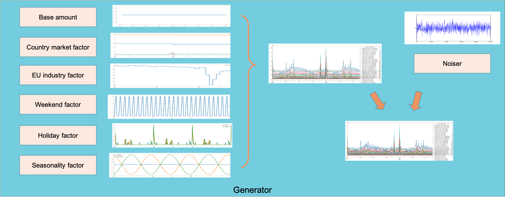
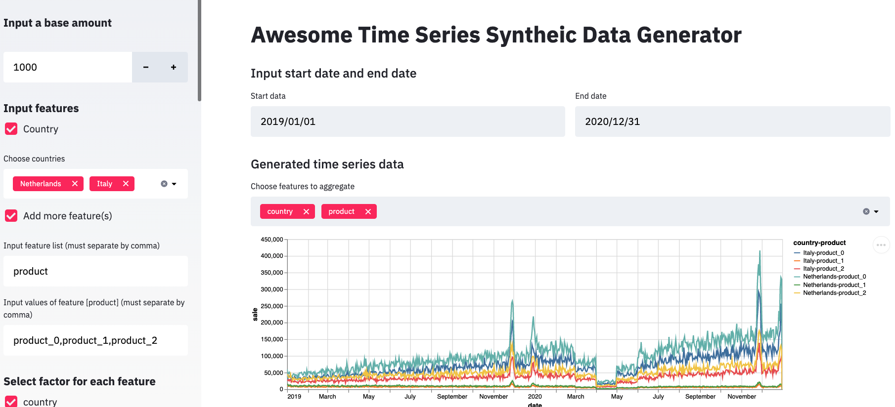

# timeseries-generator
This repository consists of a python packages that generates synthetic time series dataset in a generic way (under `/timeseries_generator`) and demo notebooks on how to generate synthetic timeseries data (under `/examples`). The goal here is to have non-sensitive data available to demo solutions and test the effectiveness of those solutions and/or algorithms. In order to test your algorithm, you want to have time series available containing different kinds of trends. The python package should help create different kinds of time series while still being maintainable.

## `timeseries_generator` package
For this package, it is assumed that a time series is composed of a base value multiplied by many factors.
```
ts = base_value * factor1 * factor2 * ... * factorN + Noiser
```



These factors can be anything, random noise, linear trends, to seasonality. The factors can affect different features. For example, some features in your time series may have a seasonal component, while others do not.

Different factors are represented in different classes, which inherit from the `BaseFactor` class. Factor classes are input for the `Generator` class, which creates a dataframe containing the features, base value, all the different factors working on the base value and and the final factor and value.

### Core concept
- **Generator**: a python class to generate the time series. A generator contains a list of factors and noiser. By overlaying the factors and noiser, generator can produce a customized time series
- **Factor**: a python class to generate the trend, seasonality, holiday factors, etc. Factors take effect by multiplying on the base value of the generator.
- **Noised**: a python class to generate time series noise data. Noiser take effect by summing on top of "factorized" time series.
This formula describes the concepts we talk above

### Built-in Factors
- **LinearTrend**: give a linear trend based on the input slope and intercept
- **CountryYearlyTrend**: give a yearly-based market cap factor based on the GDP per - capita. 
- **EUEcoTrendComponents**: give a monthly changed factor based on EU industry product public data
- **HolidayTrendComponents**: simulate the holiday sale peak. It adapts the holiday days - differently in different country
- **BlackFridaySaleComponents**: simulate the BlackFriday sale event
- **WeekendTrendComponents**: more sales at weekends than on weekdays
- **FeatureRandFactorComponents**: set up different sale amount for different stores and different product
- **ProductSeasonTrendComponents**: simulate season-sensitive product sales. In this example code, we have 3 different types of product:
    - winter jacket: inverse-proportional to the temperature, more sales in winter
    - basketball top: proportional to the temperature, more sales in summer
    - Yoga Mat: temperature insensitive

## Installation
```sh
pip install timeseries-generator
```

## Usage
``` python
from timeseries_generator import LinearTrend, Generator, WhiteNoise, RandomFeatureFactor
import pandas as pd

# setting up a linear tren
lt = LinearTrend(coef=2.0, offset=1., col_name="my_linear_trend")
g = Generator(factors={lt}, features=None, date_range=pd.date_range(start="01-01-2020", end="01-20-2020"))
g.generate()
g.plot()

# update by adding some white noise to the generator
wn = WhiteNoise(stdev_factor=0.05)
g.update_factor(wn)
g.generate()
g.plot()
```

### Example Notebooks
We currently have 2 example notebooks available:
1. `generate_stationary_process`: Good for introducing the basics of the `timeseries_generator`. Shows how to apply
simple linear trends and how to introduce features and labels, as well as random noise.
1. `use_external_factors`: Goes more into detail and shows how to use the `external_factors` submodule. Shows how to
create seasonal trends.

## Web based prototyping UI
We also use [Streamlit](https://streamlit.io/) to build a web-based UI to demonstrate how to use this package to generate synthesis time series data in an interactive web UI.
``` sh
streamlit run examples/streamlit/app.py
```



## License
This package is released under the [Apache License, Version 2.0](http://www.apache.org/licenses/LICENSE-2.0)
